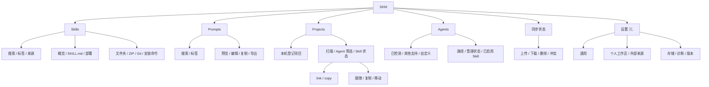
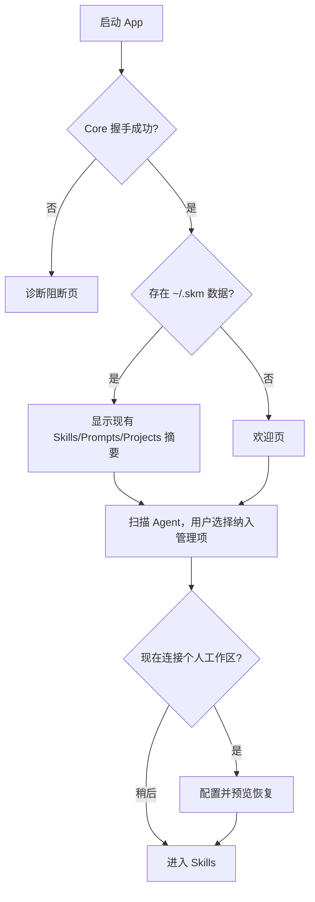

# SKM macOS 原生版原型设计

> 状态：0.5.3 Phase 1 至 Phase 3 原型均已落地；支持简体中文与英文，项目清单、Prompt 渲染、历史回滚、Quick Look 和 Sparkle 更新入口已实现，正式 Release 待触发
> 对应技术方案：[Mac原生版技术设计](Mac原生版技术设计.md)

实施状态和剩余任务以 [macOS 原生版开发进度](Mac原生版开发进度.md) 为准。

## 1. 设计方向

原生版不复刻现有 Web UI 的卡片仪表盘。它保留绿色品牌识别、Skill/Prompt/Project 的信息模型，
但改用 macOS 熟悉的三栏导航、工具栏、List、Table、Inspector、Sheet 和 Settings 窗口。

核心原则：

1. **先选择，再操作**：列表负责浏览，详情栏负责理解和启用，减少每张卡片上的重复按钮。
2. **启用状态可解释**：Activation 开关旁同时展示 Deployment 状态，不能用一个绿色开关掩盖冲突。
3. **危险操作有上下文**：删除、移动和解除部署必须显示影响对象，不使用只有“确定/取消”的空泛确认。
4. **同步先预览**：上传、下载、删除和冲突先在 Sheet 中审阅，再执行。
5. **遵循系统习惯**：设置使用 `⌘,` 独立窗口，搜索使用 `⌘F`，刷新使用 `⌘R`，列表支持键盘和右键菜单。

## 2. 信息架构



### 2.1 主侧栏

```text
SKM

资料库
  Skills                  24
  Prompts                  8

部署
  Projects                 3
  Agents                   4

────────────────────────────
● 已同步 · 2 分钟前       ↻
```

- Settings 不占主导航项，使用系统 Settings Scene。
- 同步状态固定在侧栏底部；点击打开同步预览，`⌘⇧S` 直接进入预览而不是立即写入。
- 数量是安静的次要文本，不使用彩色徽章。

## 3. 主窗口

### 3.1 尺寸与布局

| 项目 | 规格 |
| --- | --- |
| 默认窗口 | 1280 × 800 pt |
| 最小窗口 | 960 × 640 pt |
| 侧栏 | 190–240 pt，可折叠 |
| 内容列表 | 300–380 pt |
| 详情 | 剩余空间，最小 420 pt |
| 工具栏 | 系统统一工具栏 |

在窄窗口中先折叠详情为 push navigation，再允许隐藏侧栏。不能把三栏按比例压缩到文字截断。

### 3.2 通用工具栏

```text
[显示/隐藏侧栏]   Skills        [搜索…]        [同步] [＋⌄]
```

- `＋` 是当前模块的主创建动作；下拉菜单提供导入方式。
- 同步按钮展示静态状态点；进行中显示系统 ProgressView。
- 只有当前上下文可用的操作进入工具栏，删除和高级操作进入 Edit 菜单或右键菜单。

## 4. Skills 原型

### 4.1 列表与详情

```text
┌──────────────┬──────────────────────────┬──────────────────────────────────────┐
│ SKM          │ Skills                   │ code-review                          │
│              │ [搜索 Skill…]            │ local/code-review      本地           │
│ Skills    24 │ [全部] [开发] [写作]       │ 审查代码并给出可执行建议                │
│ Prompts    8 │                          │                                      │
│              │ ● code-review            │ [概览] [SKILL.md] [部署]               │
│ Projects   3 │   审查代码并给出建议       │                                      │
│ Agents     4 │   开发 · 本地             │ 标签                                 │
│              │                          │ [开发] [review]                      │
│              │   release-check          │                                      │
│              │   发布前检查              │ 可用 Agent                           │
│              │   团队 · Git             │ Claude Code          [开关：开]       │
│              │                          │ Codex               [开关：开]       │
│              │                          │ Cursor              [开关：关]       │
│              │                          │                                      │
│ ● 已同步  ↻  │                          │ [在 Finder 中显示]      [编辑]        │
└──────────────┴──────────────────────────┴──────────────────────────────────────┘
```

列表行显示：

- 名称和一行描述；
- 来源和最多两个标签；
- 来源异常、使用 fallback 或部署冲突时才显示状态图标；
- 不在每行重复展示所有 Agent 开关。

详情栏包含三个分段：

- **概览**：描述、标签、来源、hash、健康状态和快捷操作；
- **SKILL.md**：原始 Markdown、编辑和校验状态；
- **部署**：每个已管理 Agent 的 Activation、实际 Deployment 和目标路径。

### 4.2 启用交互

点击 Agent 开关后：

1. 行内显示小型 ProgressView，开关暂时不可再次操作；
2. Core 生成并应用 scoped Plan；
3. 成功后显示“已启用”，并保留目标路径作为次要文本；
4. `conflict_unmanaged` 时恢复原开关状态，并显示冲突 Sheet；
5. Sheet 只提供“在 Finder 中显示”和“取消”，不提供绕过所有权检查的覆盖按钮。

### 4.3 添加 Skill Sheet

```text
添加 Skill

[本地] [Git 仓库] [安装命令]

本地文件夹或 ZIP
┌────────────────────────────────────────┐
│  将 Skill 文件夹或 ZIP 拖到这里         │
│            [选择…]                     │
└────────────────────────────────────────┘

标签       [开发 ×] [新增标签…]

                         [取消] [添加]
```

- 本地模式同时支持拖放和 `NSOpenPanel`。
- Git 模式接受 URL 和 GitHub `owner/repo` 简写。
- 安装命令模式解析 `npx skills add`，明确说明不会执行 npx。
- 校验失败保留已填写内容，把错误放在对应字段下方。

## 5. Prompts 原型

```text
┌──────────────────────────┬────────────────────────────────────────────────────┐
│ Prompts                  │ code-review                         [复制 Prompt]   │
│ [搜索 Prompt…]           │ 审查代码并给出可执行建议                           │
│ [全部] [开发] [写作]      │                                                    │
│                          │ [预览] [编辑]                                      │
│ ● code-review            │ ┌────────────────────────────────────────────────┐ │
│   开发 · 2 个变量         │ │ 你是一名资深 {{language}} 工程师。              │ │
│                          │ │                                                │ │
│   release-notes          │ │ 请审查下面的代码：                              │ │
│   写作 · 无变量           │ │ {{code}}                                       │ │
│                          │ └────────────────────────────────────────────────┘ │
│                          │ 标签 [开发]             [导出] [更多…]             │
└──────────────────────────┴────────────────────────────────────────────────────┘
```

- 默认主操作是复制正文，完成后按钮图标在 150ms 内切换为勾选，并有“已复制”静态文字反馈。
- 编辑器使用原生 `TextEditor`、等宽字体和未保存状态标记。
- MVP 保留导入文件中的变量定义；变量表单渲染与“复制渲染结果”进入后续阶段。
- `baseHash` 冲突时不关闭编辑器，提供“比较磁盘版本”“另存为新 Prompt”和“取消”。

## 6. Projects 原型

### 6.1 项目详情

```text
┌──────────────────────┬────────────────────────────────────────────────────────┐
│ Projects             │ skm                                    [扫描] [＋Skill]│
│                      │ ~/Desktop/Jie-Project/skm      ● 可访问                 │
│ ● skm                │                                                        │
│   5 Skills           │ [全部] [Claude Code 3] [Codex 2]                       │
│   Claude 3 / Codex 2 │                                                        │
│                      │ Skill              Agent        状态          操作      │
│   shop-api           │ code-review        Claude       已托管        详情      │
│   2 Skills           │ release-check      Codex        外部          迁移      │
│                      │ old-skill          Claude       内容异常      移除      │
└──────────────────────┴────────────────────────────────────────────────────────┘
```

- 项目列表和详情使用二栏，不在详情内部再放卡片网格。
- Agent 筛选是项目局部控件；选择 Agent 后，Skill 详情只读取对应 Agent 文档。
- 空白项目也展示所有受支持 Agent，可完成第一次部署，不依赖已有 `.<agent>/skills` 目录。
- `扫描` 不改变部署，只刷新实际文件系统状态。

### 6.2 部署 Sheet

```text
将 Skill 添加到 skm

Skill       [code-review             ⌄]

Agent       ☑ Claude Code    ☑ Codex    ☐ Cursor

方式        ◉ 软链接          ○ 复制
            跟随个人 Library   项目可脱离 SKM 使用

变更预览
  创建  ~/.claude/skills/code-review
  创建  ~/.codex/skills/code-review

                                  [取消] [部署]
```

- 方式名称旁必须解释生命周期差异。
- 执行前展示 Core 返回的 dry-run Plan。
- `unchanged` 项以次要样式展示并自动跳过。
- 同名未知目标阻断整个提交，不能部分静默覆盖。

### 6.3 项目 Skill 迁移

迁移使用分步 Sheet：

1. 选择来源 Agent；
2. 选择“跟随项目”或“复制到 Library”，复制是默认项；
3. 只有复制模式显示“复制成功后移除项目原件”；
4. 展示多个 Agent 同名副本的一致性检查；
5. 确认后执行，不在复制完成前删除来源。

## 7. Agents 原型

```text
┌──────────────────────────┬────────────────────────────────────────────────────┐
│ Agents                   │ Claude Code                                        │
│ 已检测                   │ ● 已检测                      [纳入管理：开]        │
│ ● Claude Code            │                                                    │
│ ● Codex                  │ Skill 目录                                         │
│                          │ ~/.claude/skills                                   │
│ 其他支持                 │ [在 Finder 中显示]                                 │
│ ○ Cursor                 │                                                    │
│ ○ Gemini CLI             │ 已启用 Skill                                       │
│                          │ code-review                                         │
│ 自定义                   │ release-check                                      │
│   Team Agent             │                                                    │
│                          │ 从管理中移除前，必须先禁用以上 Skill。              │
└──────────────────────────┴────────────────────────────────────────────────────┘
```

- “已检测”只描述本机目录，不自动等于“纳入管理”。
- 自定义 Agent 创建时要求 ID、名称和 `~/` 下的 Skill 根目录，可选择本地图标。
- Agent 尚有用户级 Activation 时，管理开关禁用并在原位说明原因。

## 8. 同步预览原型

点击侧栏同步状态或工具栏同步按钮打开 Sheet：

```text
同步个人工作区

远端：git@github.com:me/my-skills.git
上次同步：2 分钟前

[全部 5] [上传 2] [下载 1] [删除 1] [冲突 1]

↑ code-review       Skill     本地已修改
↓ release-notes     Prompt    远端已修改
× old-prompt        Prompt    远端已删除
! shared-review     Skill     两端均已修改
  冲突选择：  ◉ 保留本地   ○ 使用远端

外部来源将在个人工作区完成后更新。

                          [取消] [开始同步]
```

- 未配置工作区时，同步按钮打开 Settings 的 Git 页面。
- 冲突没有全部解决时，“开始同步”不可用。
- 删除与普通上传/下载使用不同图标和文字，不只靠颜色。
- 同步中使用一个总进度和当前阶段文字，不为每行放循环动画。
- 完成后显示上传、下载、删除、来源警告和部署刷新结果。

## 9. Settings 原型

Settings 使用 macOS 独立窗口：

```text
[通用] [Git] [高级]
```

### 通用

- 语言：跟随系统 / 简体中文 / English；
- 外观：跟随系统 / 浅色 / 深色；
- 列表密度：默认只提供系统标准密度，第一版不增加紧凑自定义项；
- 启动时检查同步状态。

### Git

- 个人工作区：URL、ref、root、连接测试、移除连接；
- 外部 Skill 来源：列表、单来源更新、删除绑定；
- 展示实际使用的 Git 路径和最后认证错误；
- 不提供 Token 明文输入和保存。

### 高级

- SKM 数据目录，只读显示并支持 Finder reveal；
- App/Core/Schema 版本；
- Doctor 检查；
- 复制脱敏诊断信息；
- 检查更新。

## 10. 首次启动



- 检测到现有 CLI 数据时使用“继续使用现有资料库”，不能叫“导入”或“迁移”。
- 首次启动不会自动启用任何新 Agent。
- 工作区配置可以跳过，不阻断本地使用。

## 11. 状态设计

每个页面至少覆盖：

| 状态 | 表现 | 允许操作 |
| --- | --- | --- |
| Loading | 当前内容位置显示 ProgressView，不清空侧栏 | 可切换页面 |
| Empty | 说明为什么为空，并提供一个直接创建动作 | 添加/导入 |
| Failed | 原位错误、重试、复制诊断 | 不隐藏已有缓存内容 |
| Stale | 顶部显示“磁盘内容已变化” | 刷新；编辑草稿不被覆盖 |
| Working | 禁用重复提交，展示阶段文字 | 可安全取消时才显示取消 |
| Conflict | Sheet 展示目标、原因和恢复动作 | 不提供未知目标覆盖 |
| Offline Git | 保留本地内容，显示来源更新失败 | 重试或打开设置 |

## 12. 视觉规范

### 12.1 系统优先

- 使用系统字体、SF Symbols、系统 List/Table/Form/Sheet/Toolbar。
- 使用系统窗口背景和 Material，不绘制全窗口渐变或大面积卡片阴影。
- 绿色保留给品牌、成功同步和主选中状态；警告和错误使用系统语义色。
- 图标使用一套 SF Symbols，普通正文旁保持一致的视觉重量。
- 图片和自定义 Agent 图标增加低透明度 1pt 轮廓，避免浅色背景边缘消失。

### 12.2 圆角与层级

- 标准系统控件不覆盖系统圆角。
- 自定义拖放区使用 12pt 外圆角；内部预览为 8pt，二者间距 4pt，保持同心关系。
- 结构依靠 divider、List selection 和 Inspector 分栏；阴影只用于浮层和 Sheet。

### 12.3 动效

- 高频 hover、选择和状态颜色变化不超过 150ms。
- 标准 Button、Toggle 和 Sheet 使用系统动效，不叠加自定义弹跳。
- 自定义图标状态切换使用 opacity、scale `0.25 → 1` 和 blur `4 → 0`，时长 150ms。
- 自定义可点击缩略图按下时最多缩放到 `0.96`。
- 同步 Sheet 等低频分段进入可使用 `0.3s`、bounce 为 `0` 的 spring。
- 首次加载不播放逐项进入动画；减少动态效果开启时取消非必要位移和缩放。
- 动效不能是唯一反馈，始终同时保留文字、图标或颜色状态。

## 13. 键盘与菜单

| 快捷键 | 操作 |
| --- | --- |
| `⌘N` | 当前模块新建 Skill 或 Prompt |
| `⌘O` | 导入 Skill/Prompt 或添加项目 |
| `⌘F` | 聚焦当前列表搜索 |
| `⌘R` | 刷新当前页面/扫描当前项目 |
| `⌘⇧S` | 打开同步预览 |
| `⌘,` | 设置 |
| `⌘⌫` | 删除当前选中项，仍需影响确认 |
| `Space` | Quick Look 当前 Skill/Prompt 内容 |
| `Return` | 打开当前项或开始编辑 |

所有主要动作必须可以通过菜单找到，不能只存在于悬停按钮或右键菜单。

## 14. 可访问性与本地化

- VoiceOver 将 Skill 行读作“名称、来源、标签、健康状态”，不朗读 hash 全值。
- Agent 开关标签包含 Skill 名称，例如“为 Codex 启用 code-review”。
- 状态不能只依赖红绿颜色，必须有图标和文字。
- 支持 Full Keyboard Access、减少动态效果、提高对比度和系统字体缩放。
- 中文和英文从第一版使用 String Catalog；固定 ID、路径、hash 保持等宽显示。
- 界面文案使用“Skill”“Prompt”“Agent”等项目既有术语，不在不同页面混用“插件”“模板”“机器人”。

## 15. MVP 原型评审清单

1. 用户能否在 10 秒内找到一个 Skill 并看出它启用了哪些 Agent？
2. 用户能否区分 Library 拥有、用户启用和项目部署？
3. link 与 copy 的生命周期差异是否在确认前可见？
4. 未知目标冲突是否明确阻断且没有危险快捷覆盖？
5. 同步删除和冲突是否在执行前可审阅？
6. 检测到 Agent 是否不会被误解为自动管理？
7. 现有 CLI 用户是否能直接看到原有 `~/.skm` 数据？
8. 空白项目是否能完成首次部署？
9. 所有主操作是否能用键盘完成？
10. 浅色、深色、窄窗口和 VoiceOver 下是否保持相同信息含义？
