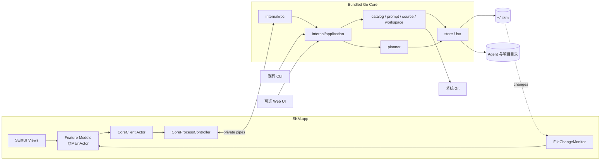

# SKM macOS 原生版技术设计

> 状态：0.5.2 Phase 1 与 Phase 2 工程实现已完成；Bundle ID 固定为 `com.zzzzzyijie.skm`，真实 Developer ID 签名、公证和 Gatekeeper 本地闭环已验收，干净机 Tag 工作流与正式 Release 待触发
> 基线：SKM v0.5.0、持久化 schema v2
> 目标：在不重写 Go 领域逻辑、不破坏 CLI 兼容性的前提下，提供真正的 macOS 原生应用。

实施状态和剩余任务以 [macOS 原生版开发进度](Mac原生版开发进度.md) 为准。

## 1. 结论

原生版采用下面的组合：

```text
SwiftUI 原生界面
    ↓ Swift Concurrency
CoreClient Actor
    ↓ stdin/stdout JSON-RPC（私有子进程管道，不监听端口）
App 内捆绑的 Go Core
    ↓
application use cases
    ↓
catalog / prompt / source / workspace / planner / store
    ↓
~/.skm、Agent Skill 目录、项目目录、系统 Git
```

第一版不采用以下方案：

- 不在 Swift 中重写 Library、Activation、Project、同步和冲突规则。
- 不让 App 依赖用户通过 Homebrew 或 curl 安装的 `skm`，App 始终调用同版本的捆绑 Core。
- 不继续通过 `localhost` HTTP 服务连接原生界面。
- 不在第一版使用 cgo、静态库或 XCFramework 直接嵌入 Go。
- 不以 Mac App Store 为首发渠道；首发使用 Developer ID 签名、公证的 DMG。

这个方案延续当前设计文档已经提出的“macOS App 使用稳定 JSON envelope 调用同一 CLI
领域逻辑”，并把 envelope 明确为可版本化的长连接协议。

## 2. 设计目标

### 2.1 产品目标

1. 原生覆盖当前 Web UI 的完整主流程：Skill、Prompt、Agent、用户级启用、项目本机部署、
   Git Source 和个人工作区同步。
2. App 与 CLI 共享 `~/.skm`，任何一端创建的数据都能被另一端读取。
3. 文件写入、部署、删除和同步继续由 Go Core 执行，保留现有安全保护。
4. 使用 macOS 原生窗口、菜单、快捷键、文件选择、拖放、剪贴板、通知和辅助功能。
5. App 崩溃或 Core 异常时，不损坏 Catalog、State、不可变对象或项目部署结果。

### 2.2 非目标

- 不执行 Skill 中的脚本。
- 不管理 Agent 账号或模型调用。
- 不接管 Git 凭据；继续使用系统 Git、SSH Agent 和 Credential Helper。
- 不在第一版增加云端账号体系。
- 不在第一版实现 CLI 尚未支持的自动覆盖或隐式优先级。

## 3. 现有实现约束

原生版必须保留以下事实和边界：

| 现有能力 | 原生版约束 |
| --- | --- |
| `~/.skm` 是个人状态根目录 | 继续作为 CLI 与 App 的唯一事实源，不迁移到 SwiftData |
| `objects/<hash>` 是不可变 Skill 快照 | App 不直接编辑对象目录，更新仍走写时复制 |
| `prompt-objects/<hash>` 是不可变 Prompt 快照 | App 只提交编辑内容和 `baseHash` |
| `Activation` 与 `Deployment` 分离 | 界面不能把“期望启用”和“当前目标状态”合并成一个布尔值 |
| Planner 拒绝未知目标 | 原生开关遇到冲突时必须回滚视觉状态并展示原因 |
| Store 使用全局文件锁 | App 与外部 CLI 并发时继续由 Core 串行化写操作 |
| YAML 使用原子写入 | Swift 不直接读写或协调 YAML 文件 |
| Git 凭据不写入 SKM | App 不提供 Token 明文保存字段 |
| Web API 含有比 CLI 更丰富的视图模型 | 不能只把现有 CLI 命令逐条映射成按钮 |

当前 HTTP handler 同时承担协议解析和业务编排。原生开发前应先提取应用层用例，避免
HTTP、CLI 和原生 Bridge 各自复制一遍“加锁 → 调用 Manager → Build Plan → Apply”的流程。

## 4. 总体架构



### 4.1 SwiftUI App

Swift 侧只负责：

- 窗口、导航、选择状态和表单状态；
- 将用户意图转换为 Core 请求；
- 解码结果、展示进度和错误；
- `NSOpenPanel`、`NSSavePanel`、`NSPasteboard`、拖放和菜单快捷键；
- 监听 Core 之外的 CLI 写入并触发只读刷新；
- 保存窗口、视图模式和最近选择等设备级偏好。

Swift 侧不负责：

- 解析或保存 SKM YAML；
- 计算 Skill hash；
- 创建或删除 Agent 目录；
- 判断目标是否由 SKM 管理；
- 计算同步冲突或部署 Plan；
- 直接执行 Git 命令。

### 4.2 Go Core

Go Core 是 App Bundle 内的辅助可执行文件，由主 App 启动并随 App 退出。建议在现有
`skm` 二进制中增加隐藏命令：

```bash
skm core --stdio
```

App Bundle 内可以把同一产物命名为 `skm-core`，但构建来源和版本注入与 CLI 保持一致。
原生 App 必须通过 Bundle 路径启动该文件，不能通过 `PATH` 查找。

当前版本变量分别位于 CLI 和 Server 包。实现 Bridge 前应先新增无反向依赖的
`internal/buildinfo`，由 CLI、HTTP Server 和 Core 握手共同读取，避免三个入口显示不同版本。

Core 负责：

- 协议握手和能力声明；
- 所有查询与写入用例；
- Store 文件锁；
- 长任务进度通知；
- 把内部错误转换成稳定错误码；
- 退出前完成当前原子步骤，不在中间状态强制终止写操作。

### 4.3 应用层提取

新增 `internal/application`，承载跨包用例编排。建议的依赖方向：

```text
cli       ─┐
server    ─┼─> application ─> catalog/source/workspace/prompt/planner/store
rpc/core  ─┘
```

首批服务接口：

```go
type Service struct {
    Store *store.Store
}

func (s *Service) ListSkills(ctx context.Context, query SkillQuery) ([]SkillView, error)
func (s *Service) UpdateSkill(ctx context.Context, input UpdateSkillInput) (SkillUpdateResult, error)
func (s *Service) SetActivation(ctx context.Context, input ActivationInput) (domain.Plan, error)
func (s *Service) PreviewWorkspace(ctx context.Context) (workspace.Preview, error)
func (s *Service) SyncWorkspace(ctx context.Context, input SyncInput, progress ProgressSink) (workspace.Result, error)
```

`application` 可以返回面向调用方的稳定 View DTO，但不能包含 HTTP 状态码、Swift 类型或
界面文案。HTTP handler 和 CLI 逐步迁移到这一层；不要求在创建 Xcode 工程前一次性重构全部命令。

## 5. Core Bridge 协议

### 5.1 传输

- 主 App 使用 `Process` 启动捆绑 Core。
- 请求写入 Core 的 stdin，响应和通知从 stdout 读取。
- stderr 只写诊断日志，不承载协议数据。
- 使用连续 JSON 消息，每条消息以换行结尾。
- 单条消息上限 16 MiB；超限返回协议错误并保持进程可用。
- 不启动 TCP/Unix 网络监听，不需要 CSRF、Host 或 Origin 校验。

### 5.2 握手

App 启动后第一条请求必须是：

```json
{"jsonrpc":"2.0","id":"1","method":"system.handshake","params":{"protocolVersion":1,"appVersion":"0.5.2"}}
```

Core 返回：

```json
{
  "jsonrpc": "2.0",
  "id": "1",
  "result": {
    "protocolVersion": 1,
    "coreVersion": "0.5.2",
    "schemaVersion": 2,
    "promptSchemaVersion": 1,
    "workspaceSchemaVersion": 1,
    "capabilities": ["skills.edit", "workspace.sync", "projects.scan"]
  }
}
```

规则：

- App 与 Core 主版本不兼容时进入阻断页，不继续读取或写入状态。
- 小版本差异通过 `capabilities` 降级，不根据版本字符串猜测能力。
- App 与捆绑 Core 应使用同一发布 Tag；握手差异通常表示 Bundle 损坏。

### 5.3 方法命名

第一阶段至少提供：

```text
system.handshake          system.version             system.doctor
dashboard.get
skills.list               skills.get                 skills.add
skills.validate           skills.update              skills.remove
skills.detach             skills.prune
tags.list                 tags.create                tags.rename
tags.delete               tags.replace
agents.list               agents.configure           agents.custom.save
agents.custom.delete
activations.status        activations.enable         activations.disable
sources.list              sources.add                sources.update
sources.remove            sources.sync
workspace.get             workspace.configure        workspace.preview
workspace.sync
prompts.list              prompts.get                prompts.create
prompts.validate          prompts.update             prompts.render
prompts.export            prompts.remove
projects.list             projects.get               projects.add
projects.scan             projects.deploy            projects.unlink
projects.skill.get        projects.skill.migrate     projects.skill.remove
projects.unregister
```

后续增加 CLI 独有能力：

```text
projects.require          projects.vendor            projects.apply
projects.dependencies     projects.removeDependency
```

### 5.4 进度通知

Git clone、Source 更新和工作区同步可能持续数秒。Core 使用通知发送阶段进度：

```json
{
  "jsonrpc": "2.0",
  "method": "operation.progress",
  "params": {
    "operationId": "sync-42",
    "phase": "fetching",
    "completed": 1,
    "total": 3,
    "message": "正在更新 team-skills"
  }
}
```

进度是辅助信息，最终结果仍以原请求响应为准。写操作不得因为 App 暂时没有读取进度而阻塞。

### 5.5 错误模型

当前 `apperr` 只有少量调用，原生版前应补齐稳定错误分类：

```json
{
  "jsonrpc": "2.0",
  "id": "18",
  "error": {
    "code": -32009,
    "message": "目标已存在且不由 SKM 管理",
    "data": {
      "kind": "conflict_unmanaged",
      "retryable": false,
      "target": "~/.codex/skills/code-review"
    }
  }
}
```

必须稳定支持的 `kind`：

```text
validation_failed      not_found             ambiguous_id
edit_conflict          not_editable          still_referenced
conflict_unmanaged     managed_target_changed
workspace_conflict     git_auth_failed        git_non_fast_forward
project_unreachable    permission_denied      protocol_incompatible
internal_error
```

界面根据 `kind` 决定恢复动作，根据 `message` 展示具体原因。不能分析英文错误字符串决定行为。

### 5.6 重试和取消

- 只读请求可以自动重试一次。
- 写请求失败后不自动重放；用户刷新状态后再次确认。
- 每个写请求携带 `operationId`，用于日志和进度关联。
- 第一版的取消只在可安全中断的网络准备阶段生效；进入原子落库或部署阶段后显示“正在完成”，
  不强杀 Core。

## 6. Swift 工程设计

建议目录：

```text
macos/
├── SKM.xcodeproj
├── SKMApp/
│   ├── App/
│   │   ├── SKMApp.swift
│   │   ├── AppCoordinator.swift
│   │   └── AppCommands.swift
│   ├── CoreBridge/
│   │   ├── CoreClient.swift
│   │   ├── CoreProcessController.swift
│   │   ├── RPCMessage.swift
│   │   └── CoreError.swift
│   ├── Models/
│   ├── Features/
│   │   ├── Skills/
│   │   ├── Prompts/
│   │   ├── Projects/
│   │   ├── Agents/
│   │   ├── Sync/
│   │   ├── Onboarding/
│   │   └── Settings/
│   ├── SharedUI/
│   ├── Resources/
│   └── Localizable.xcstrings
├── SKMAppTests/
├── SKMAppUITests/
└── Scripts/
    └── build-go-core.sh
```

### 6.1 状态管理

- 最低系统建议 macOS 14。
- 使用 SwiftUI、`NavigationSplitView`、Observation 和 Swift Concurrency。
- `CoreClient` 是 Actor，保证请求 ID、写管道和 pending continuation 的线程安全。
- Feature Model 使用 `@MainActor @Observable`，只保存页面状态，不保存第二份领域数据库。
- 每个页面统一使用 `idle / loading / loaded / empty / failed` 状态。
- 长任务使用 `AsyncStream<OperationProgress>` 驱动 sheet 内进度。

不引入 SwiftData。筛选、排序和草稿可以存在内存或 `UserDefaults`，但 Skill、Prompt、Agent、
Activation、Project 和 Source 都以 Go Core 返回为准。

### 6.2 文件变化

App 内操作完成后由对应请求结果直接更新界面，并异步重新读取权威状态。为了发现外部 CLI 修改：

1. 监听 `~/.skm` 父目录，而不是单个原子替换文件；
2. 事件去抖 250ms；
3. App 活跃时重新读取当前页面；
4. 编辑器存在未保存草稿时只显示“磁盘内容已变化”，不覆盖草稿；
5. 项目目录只监听当前打开项目，切换项目时更换监听目标。

### 6.3 原生系统集成

| 场景 | 原生 API |
| --- | --- |
| 导入 Skill 文件夹/ZIP | `NSOpenPanel`，支持目录、`.zip` 和拖放 |
| 添加项目 | `NSOpenPanel` 只选目录 |
| 导入/导出 Prompt | `NSOpenPanel` / `NSSavePanel` |
| 复制 Prompt | `NSPasteboard` |
| 打开项目或 Skill 来源 | `NSWorkspace.open` / Finder reveal |
| 设置 | SwiftUI `Settings` scene，快捷键 `⌘,` |
| 菜单 | `Commands`，提供新建、导入、同步、删除、刷新 |
| 搜索 | `.searchable`，快捷键 `⌘F` |
| 帮助与诊断 | Help 菜单、诊断窗口、复制诊断信息 |

Finder 路径选择不再由 Go 通过 `osascript` 完成。Swift 只把用户选择的路径传给 Core，Core
仍必须做规范化、范围、文件类型和 Skill 格式校验。

## 7. 数据、并发与一致性

### 7.1 数据位置

| 数据 | 位置 |
| --- | --- |
| Library、Prompt、Source、Activation、Project 注册 | 继续使用 `~/.skm` |
| 项目 require/vendor | 继续使用 `<project>/.skm` |
| Agent 部署结果 | 继续使用各 Agent 的 Skill 目录 |
| 窗口大小、侧栏状态、列表显示方式 | `UserDefaults` |
| App 日志 | `~/Library/Logs/SKM/`，轮转且不记录 Prompt 正文或凭据 |
| 项目授权书签 | App 私有 Application Support，按规范化路径索引 |

### 7.2 并发

- Core 的写请求先进入进程内串行队列，再获取现有 Store 文件锁。
- CLI 与 App 同时写入时由 `locks/state.lock` 串行化。
- 读取复杂聚合视图时建议短暂获取共享一致性快照；第一版可继续使用独占锁，先保证正确性。
- 编辑 Skill/Prompt 必须携带 `baseHash`，保持乐观并发控制。
- 同步预览携带 `baseRevision`；远端变化后重新预览，不自动 force push。

### 7.3 进程异常

- Core 未进入写操作时崩溃：自动重启一次并恢复只读页面。
- Core 在写请求期间退出：不自动重放；重新启动后执行 `doctor` 和页面刷新。
- 连续两次启动失败：显示阻断诊断页，提供“复制日志”和“在终端运行诊断”。
- App 退出时先关闭写管道，给 Core 最多 3 秒完成退出；仍未退出再终止进程。

## 8. 权限与安全

### 8.1 分发模型

第一版使用：

- Developer ID Application 签名；
- Hardened Runtime；
- Apple Notarization 和 stapling；
- 非 Mac App Store 分发；
- App Sandbox 关闭。

原因是 SKM 需要管理多个隐藏的用户级 Agent 目录、用户任意选择的项目、符号链接和系统 Git
凭据。App Store Sandbox 会要求用户逐个授权 Agent 根目录，并使 CLI/App 共用路径与 Git
流程复杂化。即使关闭 Sandbox，项目仍应通过 `NSOpenPanel` 由用户显式添加，以符合用户预期和
macOS 隐私提示。

### 8.2 安全规则

- App 不以 root 运行，也不请求辅助特权工具。
- Core 继承当前用户权限，不能写入用户无权访问的路径。
- 不把用户输入拼接成 shell 命令；使用 `Process.executableURL + arguments`。
- Git 继续通过参数数组执行，不执行任意 shell。
- UI 不提供覆盖未知目标的快捷按钮；强制移除必须走现有所有权校验。
- 日志对 URL 中的 userinfo、环境变量、Prompt 正文和 secret 变量做脱敏。
- 自定义 Agent 路径继续限制在 `~/` 下，并由 Go Core 规范化。
- Bridge 只使用父子进程管道，不接受其他本机进程连接。

## 9. 功能分期

### Phase 0：Core 契约

状态：已完成。

- 提取 `internal/application` 的首批用例；
- 增加稳定错误码；
- 实现 `core --stdio`、握手、Skills/Agents/Activation 查询与写入；
- 为 Bridge 添加协议 fixture 和并发测试。

### Phase 1：原生 MVP

状态：工程实现与本地正式签名、公证、stapling、Gatekeeper 闭环已完成。

- 首次启动与现有 `~/.skm` 检测；
- Skills 列表、详情、文件夹/ZIP/Git/安装命令导入、编辑、标签、移除；
- Agent 扫描、配置、自定义 Agent、用户级启用；
- Prompts 列表、创建、导入、编辑、复制、导出、移除；
- 空状态、错误状态、键盘和 VoiceOver；
- DMG 签名与公证。

### Phase 2：项目与同步

状态：当前设计范围已完成。

- 项目登记、扫描、link/copy、迁移、解绑和注销；
- Source 管理、统一同步和个人工作区冲突解决；
- Diagnostics、日志导出和更新检查；
- Homebrew Cask。

### Phase 3：完整 CLI 能力

- `project require/vendor/apply`；
- Prompt 变量表单和渲染后复制；
- 历史快照、差异和回滚；
- Sparkle 2 自动更新。

## 10. 构建、版本与发布

### 10.1 构建

`macos/Scripts/build-go-core.sh` 分别构建 `darwin/arm64` 和 `darwin/amd64`，再生成 Universal 2
辅助可执行文件。构建使用：

```text
CGO_ENABLED=0
-trimpath
-ldflags "-s -w -X github.com/zzzzzyijie/skm/internal/buildinfo.Version=<tag>"
```

签名顺序：

```text
构建 Go Core
→ 合并 Universal 2
→ 签名嵌套 Core
→ 签名 SKM.app
→ 公证并 staple SKM.app
→ 生成最终 ZIP 与 DMG
→ 签名 DMG
→ 公证并 staple DMG
→ Gatekeeper 检查 App 与 DMG
→ 上传 Release
```

该流程已实现于 `macos/Scripts/package-release.sh` 与 `.github/workflows/release.yml`。本地可用
`--preview` 使用 ad-hoc 签名生成不可分发的本地候选包；正式模式强制要求 Developer ID Application 与 App Store
Connect Team API Key，并在上传前检查 Universal 2、版本一致性、签名、notarization ticket、
Gatekeeper 与 SHA-256。

真实凭据配置、命令、验收输出和故障记录见
[macOS 原生 App 签名、公证与发布流程](Mac原生App签名公证与发布流程.md)。

### 10.2 版本

- App、捆绑 Core 和 CLI 使用同一个语义化 Tag。
- `CFBundleShortVersionString` 等于去掉 `v` 的 Tag。
- `CFBundleVersion` 使用 CI 递增构建号。
- Phase 1/2 工程完成版本为 `v0.5.2`；正式 Tag 与 Release 创建前仍只属于工程候选版本。

### 10.3 发布产物

保留当前 CLI 产物，并新增：

```text
SKM-<version>-universal.dmg
SKM-<version>-universal.zip
```

Homebrew 继续分发 CLI；另建 Cask：

```bash
brew install --cask zzzzzyijie/tap/skm-app
```

CLI Formula 与 App Cask 必须避免安装同一路径或互相覆盖。App 使用自己 Bundle 内的 Core。

## 11. 测试策略

### 11.1 Go

- `application` 用例表驱动测试；
- JSON-RPC 请求/响应 golden fixture；
- 协议版本和 capability 测试；
- Core 崩溃、半包、超限消息和 stderr 噪声测试；
- CLI、HTTP、Bridge 对相同用例产生一致结果的契约测试；
- 继续运行 `go test ./...`、`go test -race ./...`、`go vet ./...`。

### 11.2 Swift

- `CoreClient` 编解码、并发请求、超时和重启单元测试；
- Feature Model 使用 Mock CoreClient 测试 loading/empty/error/conflict；
- XCUITest 覆盖导入 Skill、启用 Agent、编辑 Prompt、添加项目和同步预览；
- Accessibility Inspector 检查 VoiceOver 名称、焦点顺序和 Full Keyboard Access；
- 浅色、深色、减少动态效果和高对比度快照检查。

### 11.3 端到端隔离

UI Test 启动 App 时注入专用：

```text
SKM_HOME=<temporary>/state
SKM_USER_HOME=<temporary>/user
SKM_PROJECT=<temporary>/project
```

任何自动化测试都不能读写真实 `~/.skm`、真实 Agent 目录或真实项目。

## 12. 关键验收标准

原生 MVP 进入发布候选前必须满足：

1. App 能直接读取现有 CLI 创建的 `~/.skm`，无需导入或迁移。
2. App 和 CLI 交替修改同一测试 Library，不丢数据、不产生破损 YAML。
3. App 不能覆盖未知 Agent Skill 目标。
4. Skill/Prompt 编辑冲突能保留用户草稿并给出明确恢复选项。
5. Core 异常退出后，App 能恢复只读状态且不会自动重放写请求。
6. DMG 在一台没有 Go、Homebrew 和 SKM CLI 的干净 Mac 上可以启动。
7. App、Core 和 Release 版本一致，签名、公证和 stapling 校验通过。
8. 主流程支持键盘操作和 VoiceOver，浅色/深色模式无信息缺失。

## 13. 风险与应对

| 风险 | 应对 |
| --- | --- |
| HTTP handler 中业务编排过多 | 先提取 MVP 所需用例，不做一次性全仓重构 |
| CLI 与 App 并发修改 | 继续使用 Store 文件锁，外部变化触发刷新 |
| Core 与 App 协议漂移 | 握手、capabilities、golden fixture、同 Tag 捆绑 |
| GUI App 的 Git 环境与终端不同 | 展示实际 Git 路径和认证错误，不保存凭据，提供诊断 |
| Sandbox 无法覆盖 Agent/项目路径 | 首发 Developer ID 非沙盒；未来单独评估 App Store 版本 |
| 原生功能落后于 CLI | 以当前 Web parity 为 MVP，CLI-only 能力列入 Phase 3 |
| 长同步阻塞界面 | Core 后台执行、进度通知、Swift async/await |
| 原生发布链路复杂 | CI 中固定签名、公证、DMG、Cask 和干净机验收 |

## 14. 推荐的第一批开发任务

1. 定义 `internal/application` 的 Skills、Agents、Activation DTO 与错误码。
2. 用现有 server 测试固定这些 DTO 的行为，再让 HTTP handler 调用应用层。
3. 实现 `skm core --stdio` 的握手和只读方法。
4. 创建 `macos/SKM.xcodeproj`，完成 Core 启停、三栏空壳和只读 Skill 列表。
5. 打通隔离 `SKM_HOME` 的首个 XCUITest。
6. 再增加导入、启用和编辑等写操作，最后进入项目与同步。
